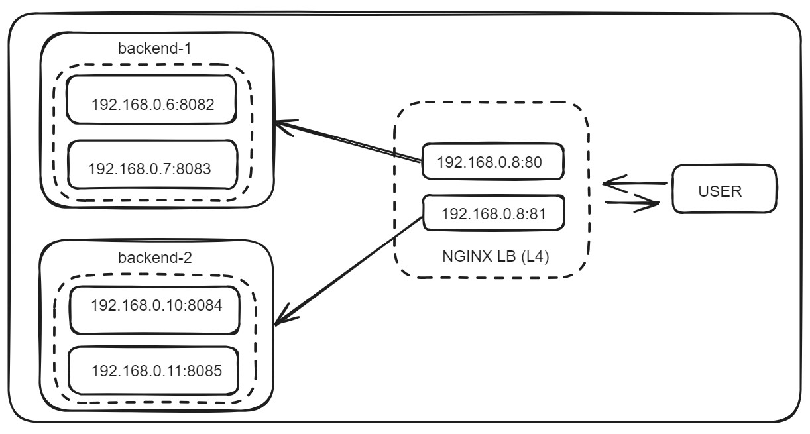

# NGINX Layer-4 Load Balancer:
NGINX can function as both an L4 (Layer 4) and an L7 (Layer 7) load balancer. When used as an L4 load balancer, NGINX typically performs simple TCP and UDP load balancing based on network information like IP addresses and ports. This allows it to distribute incoming traffic across multiple backend servers efficiently without inspecting the application data.

However, it doesn't provide the advanced content-based routing and decision-making capabilities that an L7 load balancer offers, where NGINX can inspect application-specific data like HTTP headers, cookies, and URLs to make routing decisions.




## Install Nginx:
```
### Ubuntu/Debian:

sudo apt update
sudo apt install nginx
```

```
### CentOS/RHEL:

sudo yum install epel-release
sudo yum install nginx
```

```
### Install Stream Module:

yum install nginx-mod-stream.x86_64

or,

yum -y install nginx-all-modules.noarch
```

## Configuration:
Configuring NGINX as an L4 (Layer 4) load balancer involves setting up stream modules instead of HTTP modules.

Create a Load Balancer Configuration File locate the "/etc/nginx/nginx.conf"


## Test Configuration and Reload Nginx:
```
### Check configuration file and restart the service:

nginx -t
systemctl restart nginx
```


---
---


## Building Docker Image and run NGINX Load Balancer as a Container:

This command starts a container from the "nginx_l4_lb" image, exposing port 80 and 81 on the host machine to access the Nginx server running inside the container.

```
cd for-Docker

docker build -t nginx_l4_lb .

docker run --name nginx_l4_lb -p 80:80 -p 81:81 nginx_l4_lb
```


```
docker ps

CONTAINER ID   IMAGE         COMMAND                  CREATED         STATUS          PORTS                      NAMES
0b7bba790eaa   nginx_l4_lb   "/docker-entrypoint.…"   2 minutes ago   Up 2 minutes    0.0.0.0:80-81->80-81/tcp   nginx_l4_lb
```

```
docker exec -it nginx_l4_lb bash

apt update -y
apt install net-tools -y
```

```
netstat -tlpn

Active Internet connections (only servers)
Proto Recv-Q Send-Q Local Address           Foreign Address         State       PID/Program name
tcp        0      0 0.0.0.0:80              0.0.0.0:*               LISTEN      1/nginx: master pro
tcp        0      0 0.0.0.0:81              0.0.0.0:*               LISTEN      1/nginx: master pro
```


You can access it by navigating to your browser to that URL:

http://load_balancer_ip:80

http://load_balancer_ip:81


Remember to adjust the configuration based on your specific setup, including port numbers, server names, timeouts, and any additional settings needed for your load balancing requirements.

